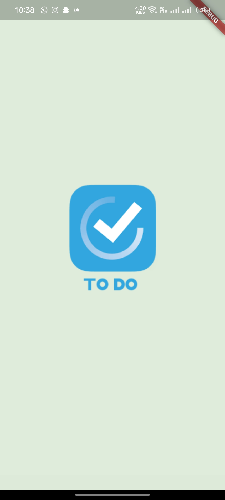
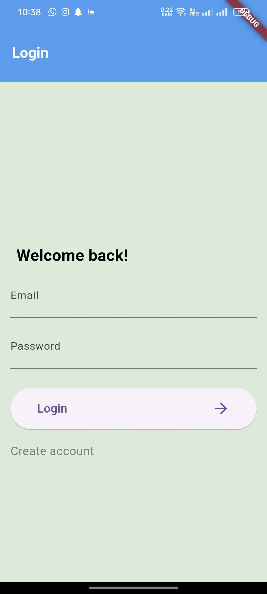
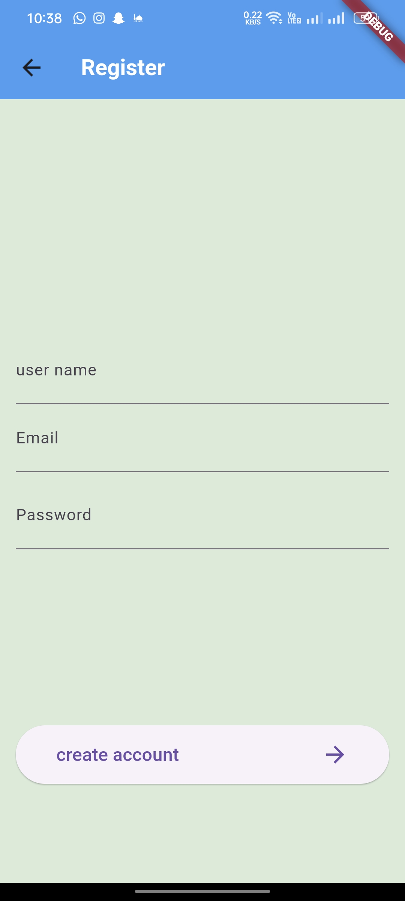
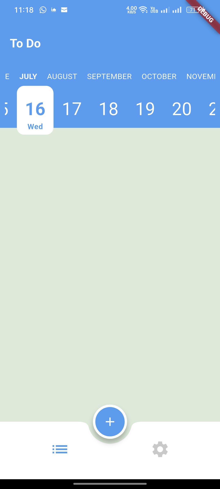
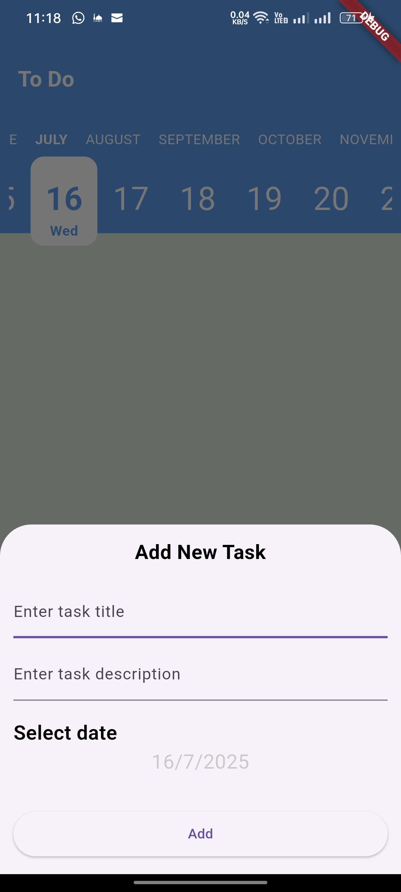
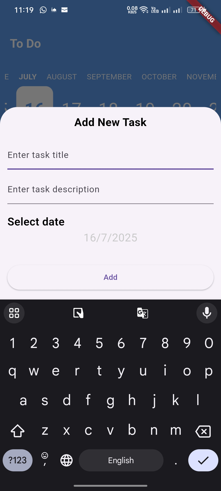
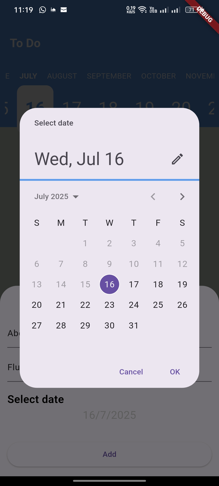
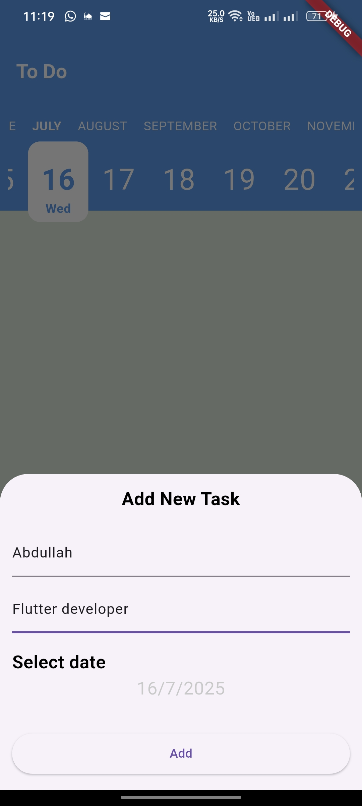
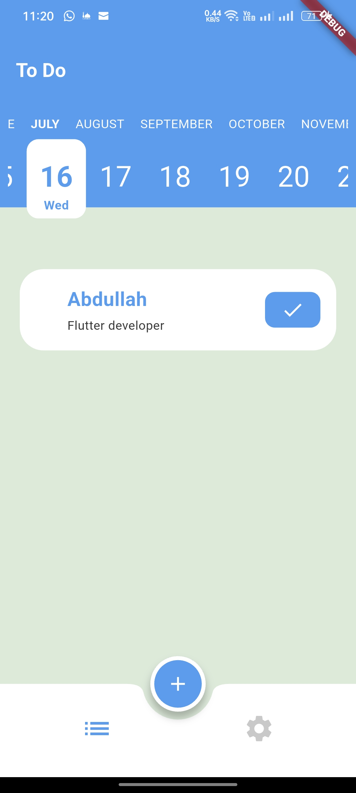
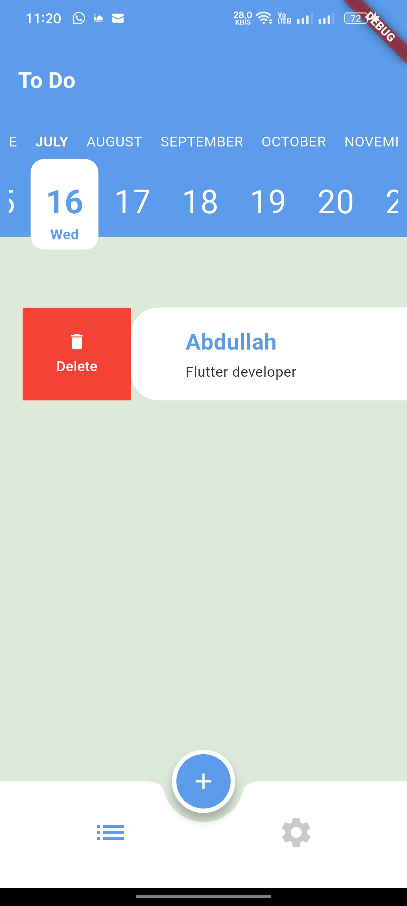

# todo

Todo application designed to help users organize their daily activities. Users can add, edit, mark as completed, and delete tasks easily.

## Getting Started

This project is a starting point for a Flutter application.

A few resources to get you started if this is your first Flutter project:

- [Lab: Write your first Flutter app](https://docs.flutter.dev/get-started/codelab)
- [Cookbook: Useful Flutter samples](https://docs.flutter.dev/cookbook)

For help getting started with Flutter development, view the
[online documentation](https://docs.flutter.dev/), which offers tutorials,
samples, guidance on mobile development, and a full API reference.

## screenshots from the application

<h3>Splash Screen</h3>

<h3>Sign in Screen</h3>

<h3>Create Account Interface</h3>

<h3>Home Page Screen</h3>

<h3>Task Creation Bottom Sheet</h3>

<h3>Keyboard-Aware Input Handling</h3>

<h3>Select a Custom Date</h3>

<h3>Enter Task Title & Details</h3>

<h3>Task Added Successfully</h3>

<h3>Swipe to Delete The Task</h3>

